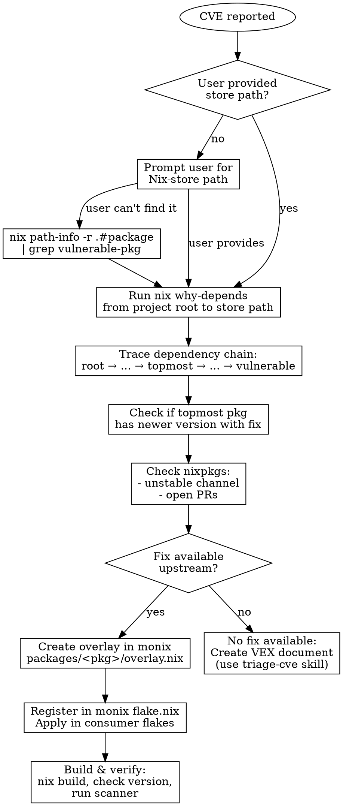

# Fix Nix CVE

## Overview

Fix CVEs in Nix flakes by tracing dependency chains with `nix why-depends` and creating overlays in monix. The key insight: find the **topmost updatable package** that bundles the fix, not the vulnerable package itself.

## When to Use

- CVE detected by Aikido or Trivy
- Nixpkgs hasn't updated yet but upstream fix exists
- Need to create overlay in monix for global fix

## Workflow



## Step 1: Get the Nix-store Path

**Both Aikido and Trivy** can provide store paths. Always prompt the user first:
```
What is the Nix-store path for the vulnerable package?
(e.g., /nix/store/abc123-tar-7.5.4)

This is shown in the Aikido/Trivy scan results.
```

**If user can't find it**, search for it:
```bash
nix path-info -r .#packages.x86_64-linux.<product> | grep <vulnerable-pkg>
```

## Step 2: Trace Dependency Chain

Run `why-depends` from your project's root package to the vulnerable store path:

```bash
nix why-depends .#packages.x86_64-linux.<product> /nix/store/<hash>-<vulnerable-pkg>-<version>
```

Example output:
```
/nix/store/...-imogen-workstation-root
└───/nix/store/...-nodejs-25.5.0
    └───/nix/store/...-tar-7.5.4
```

**Key insight:** The "topmost" updatable package here is `nodejs`, not `tar`. Updating nodejs to a version that bundles fixed tar is the solution.

## Step 3: Check Upstream for Fix

1. **Check if newer version of topmost package exists:**
   ```bash
   # Check current nixpkgs version
   nix eval nixpkgs#nodejs.version

   # Check nixpkgs-unstable
   nix eval github:NixOS/nixpkgs/nixpkgs-unstable#nodejs.version

   # Search for available versions
   nix search nixpkgs nodejs
   ```

2. **Check upstream releases** (GitHub, project website) for version bundling the fix

3. **Check nixpkgs PRs:**
   ```bash
   gh search prs --repo NixOS/nixpkgs "<package> <version>" --state open
   ```

## Step 4: Create Overlay in Monix

Create overlays in `repos/releng/monix/packages/<pkg>/overlay.nix`.

### Overlay Template

```nix
# packages/<pkg>/overlay.nix
# TEMPORARY CVE-XXXX-XXXXX FIX
# =============================================================================
# <Brief description of vulnerability>
#
# WHAT TO WATCH FOR (to know when this can be removed):
# - nixpkgs <pkg> version >= <fixed-version>
# - <specific attribute or file to check>
#
# CHECK WEEKLY (every Monday) for nixpkgs updates.
#
# HOW TO REMOVE THIS PATCH (when nixpkgs has the fix):
# 1. Delete this directory: packages/<pkg>/
# 2. Remove from monix flake.nix overlays
# 3. Remove from consumer flakes' overlay lists
# 4. Run CI to verify builds and CVE is fixed
# =============================================================================
final: prev:
let
  isLinux = prev.stdenv.isLinux;

  mkFixed = oldAttrs: rec {
    version = "<fixed-version>";
    src = prev.fetchurl {
      url = "<source-url>";
      hash = "<sri-hash>";
    };
  };

  # Version check to prevent downgrades when nixpkgs catches up
  applyIfVulnerable = pkg:
    if isLinux && pkg.version == "<vulnerable-version>"
    then pkg.overrideAttrs mkFixed
    else pkg;
in
{
  <pkg> = applyIfVulnerable prev.<pkg>;
}
```

### Register in monix flake.nix

Add to the `overlays` attribute:
```nix
overlays = {
  # ... existing overlays ...
  # CVE-XXXX-XXXXX: <description>
  <pkg>-cve-fix = import ./packages/<pkg>/overlay.nix;
};
```

## Step 5: Apply and Verify

**Apply in consumer flakes:**
```nix
overlays = [
  monix.overlays.<pkg>-cve-fix
];
```

**Verify the fix:**
```bash
# Build with overlay
nix build .#packages.x86_64-linux.<product> --print-out-paths

# Check version of previously vulnerable package
nix path-info -r result | grep <pkg>

# Re-run scanner
trivy fs --scanners vuln $(nix build .#<product> --print-out-paths)
```

## Removing Outdated CVE Fixes

When nixpkgs catches up, remove the overlay:

1. **Verify** nixpkgs has the fix:
   ```bash
   nix eval nixpkgs#<package>.version
   ```

2. **Remove** from codebase (follow HOW TO REMOVE in overlay comments)

3. **Test**: `nix flake check && nix build .#all`

## Common Patterns

| Vulnerable Pkg | Topmost Pkg | Fix Strategy |
|----------------|-------------|--------------|
| tar (npm) | nodejs | Update nodejs or patch bundled tar |
| openssl | openssl | Direct overlay (see `openssl/overlay.nix`) |
| python stdlib | python3XX | Update python version (see `python/overlay.nix`) |
| nested Go dep | go-based tool | Update the Go tool, not the dep |
| runc/containerd | docker | Override docker components (see `docker/overlay.nix`) |

## Common Mistakes

| Mistake | Fix |
|---------|-----|
| Patching vulnerable pkg directly | Find topmost bundling pkg instead |
| Skipping `why-depends` analysis | Always trace full chain first |
| Not checking nixpkgs-unstable | Fix may already exist upstream |
| Missing version guard | Add `if pkg.version == "x.y.z"` check |
| Missing removal instructions | Always include WHAT TO WATCH FOR and HOW TO REMOVE |
| Forgetting platform check | Add `isLinux` guard when appropriate |
| Not verifying after applying | Always build and check version |

## Example: OpenSSL Overlay

```nix
# packages/openssl/overlay.nix
# Override OpenSSL 3.6.0 to 3.6.1 to fix CVE-2025-15467
# CVE-2025-15467: Critical vulnerability with exploit available
# Also fixes: CVE-2025-11187, CVE-2025-15468, CVE-2025-66199
#
# WHAT TO WATCH FOR:
# - nixpkgs openssl version >= 3.6.1
#
# HOW TO REMOVE:
# 1. Delete packages/openssl/
# 2. Remove openssl-3-6-1 from flake.nix overlays
# 3. Remove from consumer flakes
final: prev:
let
  isLinux = prev.stdenv.isLinux;

  # Use builtins.fetchTarball to avoid openssl dependency cycle
  opensslSrc = builtins.fetchTarball {
    url = "https://www.openssl.org/source/openssl-3.6.1.tar.gz";
    sha256 = "0dcfhdgx39x494bdimmbdiqzypxq6vp8ndzng8kz2r549a8iwgx6";
  };

  mkOpenssl361 = oldAttrs: {
    version = "3.6.1";
    src = opensslSrc;
    # Filter patches that don't apply to new version
    patches = prev.lib.filter
      (p: !(prev.lib.hasSuffix "use-etc-ssl-certs.patch" (toString p)))
      (oldAttrs.patches or []);
  };

  applyIfVulnerable = pkg:
    if isLinux && pkg.version == "3.6.0"
    then pkg.overrideAttrs mkOpenssl361
    else pkg;
in
{
  openssl_3_6 = applyIfVulnerable prev.openssl_3_6;
  openssl = applyIfVulnerable prev.openssl;
}
```
